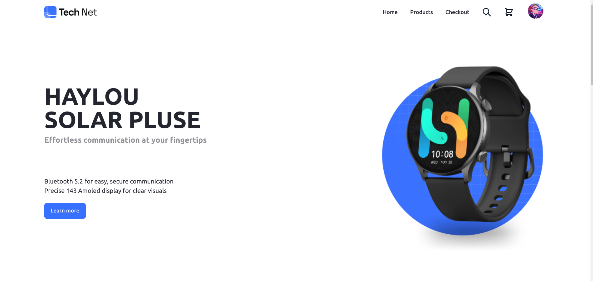
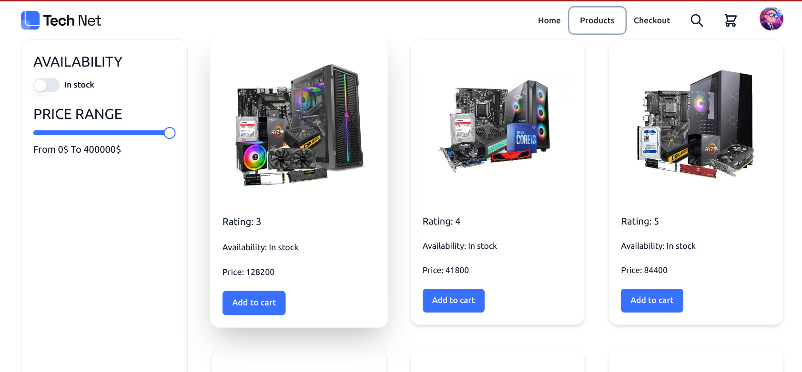

# Redux Toolkit and RTK Query Project

This project is a buying and selling products application built with Redux
Toolkit and RTK Query. It aims to demonstrate various Redux concepts and
features using the Redux Toolkit library, along with data fetching and caching
using RTK Query.

## Features

- Product listing: View a list of available products.
- Product details: Get detailed information about a specific product.
- Add to cart: Add products to the cart for purchasing.
- Cart management: View and update the items in the cart.
- Checkout: Complete the purchase by entering shipping and payment details.

## Backend API

The backend API for this project is hosted at
[https://redux-rapper-server.vercel.app/product](https://redux-rapper-server.vercel.app/product).
It provides the necessary endpoints to retrieve and manipulate product data.

## Frontend

The frontend application can be accessed at
[https://redux-reaper.vercel.app/](https://redux-reaper.vercel.app/). It
provides a user-friendly interface for browsing products, adding them to the
cart, and completing the purchase.

